<p align="center">
<h1 align="center"> MyArxiv</h1>
</p>


<p align="center">
  	<a href="https://img.shields.io/badge/version-v0.1.0-blue">
      
    </a>
  <a >
       
  	</a>
  <a >
       
  	</a>
   	<a href="https://github.com/MLNLP-World/MyArxiv/stargazers">
       
  	</a>
  	<a href="https://github.com/MLNLP-World/MyArxiv/network/members">
       
  	</a>
    <a href="https://github.com/MLNLP-World/MyArxiv/issues">
      
    </a>
    <br />
</p>
<div align="center">
<p align="center">
  <a href="#项目动机">项目动机</a>/
  <a href="#项目简介">项目简介</a>/
  <a href="#项目预览">项目预览</a>/
  <a href="#使用说明">使用说明</a>/
  <a href="#快速上手指南">快速上手指南</a>/
  <a href="#定制化指南">定制化指南</a>/
  <a href="#参考资源">参考资源</a>/
  <a href="#致谢">致谢</a>/
  <a href="#组织者">组织者</a>/
  <a href="#贡献者">贡献者</a>
</p>
</div>


---

## 项目动机

`Arxiv`作为当前最最受欢迎的学术论文预印的网站，每天有大量的最新学术论文在此网站发布。许多一线研究者，在这样信息爆炸的时代，为了第一时间有效地关注到与自己研究“相关”的学术论文，每天都需要耗费较多时间进行检索和审阅过滤掉“无关”的学术论文，这无疑为大家的科研带来了较大的负担。为了帮助大家高效地、自由地阅览Arxiv最新学术论文，本项目为大家提供了`Arxiv`个性化定制化模版，实现对特定领域的相关内容、作者与学术会议的有效跟进，将`Arxiv`定制化为`MyArxiv`。


本项目所用徽章来自互联网，如侵犯了您的图片版权请联系我们删除，谢谢。

## 项目简介

`MyArxiv`项目基于[`Arxiv官方API`](https://arxiv.org/help/api)与[`Github Actions`](https://docs.github.com/en/actions)相关服务，为大家了提供了`Arxiv`的定制化服务，使用者可以通过配置相关文件，从`Arxiv`每日发布的最新研究成果中，实现个性化地、轻松地阅览属于自己的`Arxiv`网站，其功能如下：

**基本功能**：

- 跟踪指定领域的最新成果
- 缓存指定时段的文章信息

**特色功能**：

- 快速聚焦到文章标题中的指定**关键字**
- 方便注意到文章作者中的指定**学者**
- 及时了解到相关知名**会议、期刊**的学术文章

## 项目预览

使用者可以访问[https://mlnlp-world.github.io/MyArxiv/](https://mlnlp-world.github.io/MyArxiv/)进行对当前项目进行预览，以便更好地熟悉和使用当前项目。

- `MyArxiv`总页面概览：

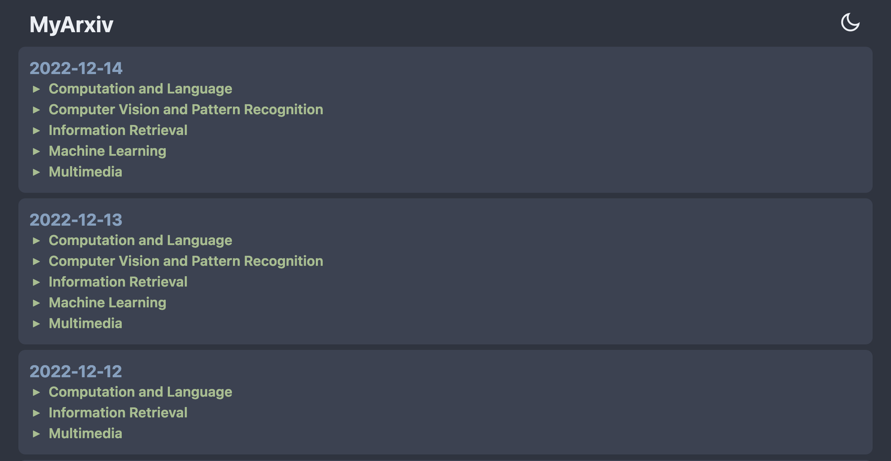

​	其中包含了指定领域的多天的文章最新更新情况

- 进一步查看领域中更新的文章列表：

​	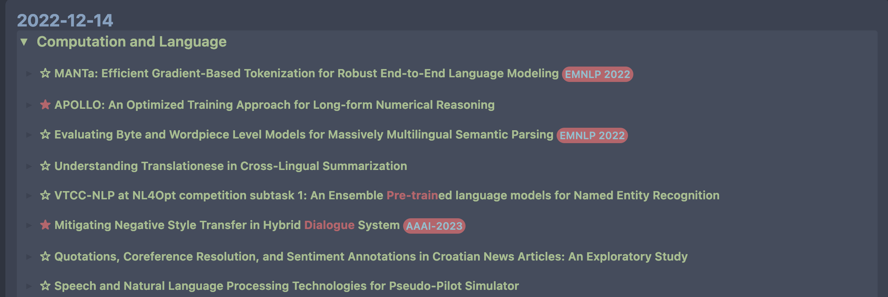

​	每一个条目中有特定类型的前缀标识（e.g.  `☆` 或 `★`标识是否有高亮的作者）、包含高亮的文章标题（e.g. `Dialogue`）以及相应的会议信息（e.g. `EMNLP 2022`）。

- 更加细化地对感兴趣的文章内容进行查看：

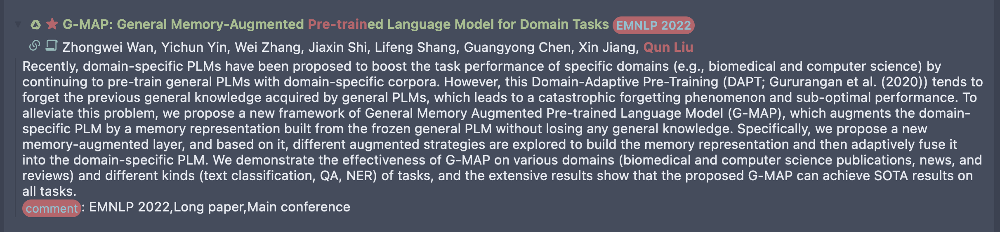

​	其中有包含高亮详细作者列表（e.g. `Qun Liu`）、摘要以及对应的`comment`（e.g. `EMNLP 2022, Long paper, Main conference`）。

## 使用说明

- 单击`标题`展开并仔细查看其摘要。
- 单击`摘要`跳转到对应的`Arxiv`文章。
- 指定关键字、指定学者和会议/期刊信息的高亮显示。
- 通过文章条目前缀标识区分论文是新提交的还是更新的`♻`。
- 通过文章条目前缀标识区分论文是否由高亮的作者撰写的`☆` 或`★`。
- 使用`Tab`键展开/折叠所有文章。
- 实现了对于Latex公式的渲染。
- 支持深色/浅色模式。

## 快速上手指南

使用MyArxiv实现个人定制的Arxiv，使用默认设置快速上手，步骤如下：

<details open="open">
  <summary>Get Start</summary>
  <ul>
       <li><a href="#create-repo"> ➤ 1. 建立仓库</a></li>
       <li><a href="#modify-cachr-url"> ➤ 2. 修改cachr url</a></li>
       <li><a href="#github-pages-start"> ➤ 3. Github pages设置</a></li>
  </ul>
</details>

<h4 id="create-repo">1. 建立仓库</h4>

当前MyArxiv仓库为模版仓库，当我们建立属于自己的MyArxiv时，需要从当前模版新建仓库到自己的Github账号下。

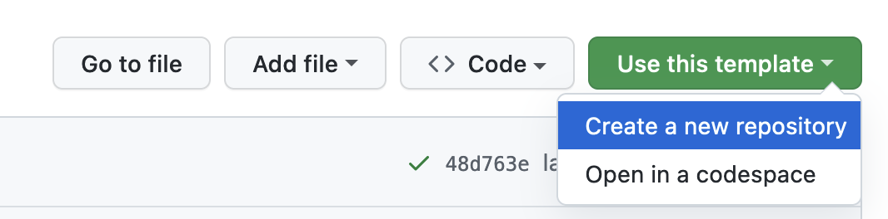

假设仓库地址为`github.com/username/reponame`，便于后续说明。

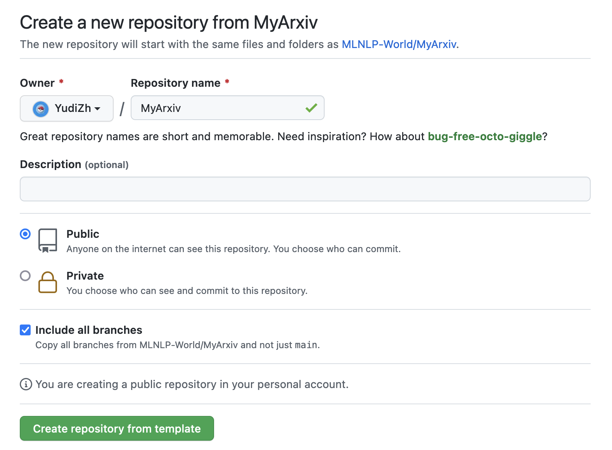

<h4 id="modify-cachr-url">2. 修改cachr url</h4>

修改`config.toml`中文件中的`cache_url`设置（MyArxiv数据缓存地址，该地址设置与你托管当前项目的网站地址相关），将其对应的Github账户，从`MLNLP-World`修改为自己当前的账户，如下图所示：

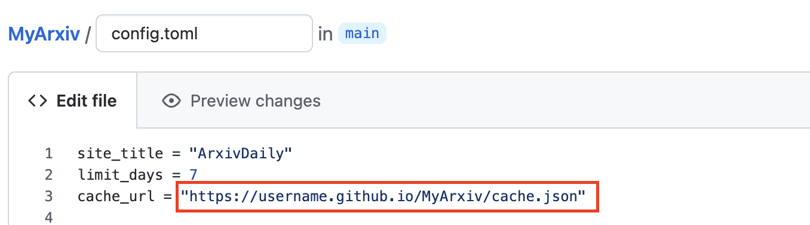

<h4 id="github-pages-start">3. Github pages设置</h4>

进入当前Repo对应的Settings后，进入Pages页面，设置`Branch`为`gh-pages`分支。

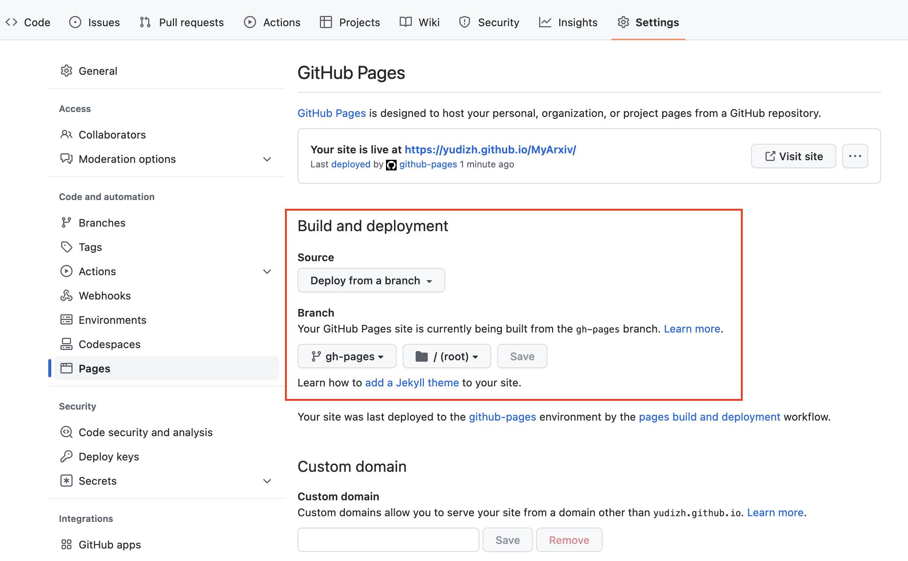

使用至此，你已经基于`MyArxiv`的默认配置实现了快速上手，直接访问Github Pages对应的网页`username.github.io/MyArxiv`，可以查看属于自己的`MyArxiv`:

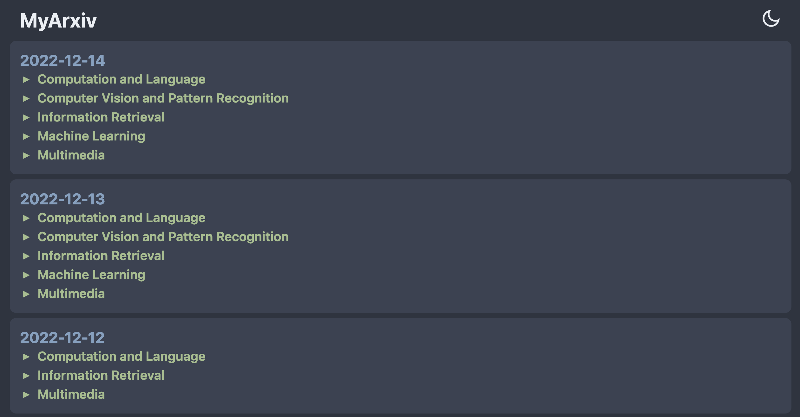

## 定制化指南

MyArxiv是高度可定制化的，使用者可以根据自己的实际需求进行更改，实现个性化定制，如下内容对于可定制化的部分进行说明。

<details open="open">
  <summary>Build Steps</summary>
  <ul>
        <li><a href="#website-settings"> ➤ 1. 托管网站设置</a></li>
        <li><a href="#Arxiv-domain"> ➤ 2. Arxiv领域偏好设置 </a></li>
        <li><a href="#highlight-scripts"> ➤ 3. 高亮脚本设置 </a></li>
        <li><a href="#workflow-settings"> ➤ 4. workflow设置 </a></li>
        <li><a href="#MyArxiv-website-settings"> ➤ 5. MyArxiv网页设置 </a></li>
        <li><a href="#Github-Pages-settings"> ➤ 6. Github Pages设置 </a></li>
  </ul>
</details>

<h4 id="website-settings">1. 托管网站设置</h4>

`config.toml`配置文件中，个人网站相关设置部分如下图所示：

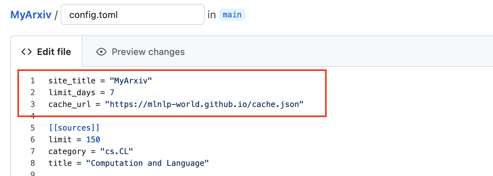

此部分与个人MyArxiv托管的网站设置相关，默认设置如下：

```toml
site_title = "MyArxiv"
limit_days = 7
cache_url = "https://mlnlp-world.github.io/MyArxiv/cache.json"
```

- `site_title`：MyArxiv网站名称，默认为`"MyArxiv"`。

- `limit_days`：MyArxiv网站所缓存的过去几天的最新论文，默认为缓存过去`7`天的最新论文。

- `cache_url`：MyArxiv数据缓存地址，该地址设置与你托管当前项目的网站地址相关。
  - 若使用默认的Github Pages，那么会在`username.github.io`域名上托管该项目，项目具体地址为`username.github.io/reponame`，就要将`cache_url`设置为`username.github.io/reponame/cache.json`。
  - 若使用其他域名`yourarxivdomain`托管该项目，则要将`cache_url`使用对应的网址进行替换，设置为`yourarxivwebsite/cache.json`。

<h4 id="Arxiv-domain">2. Arxiv领域偏好设置</h4>

`config.toml`配置文件中，Arxiv领域偏好设置部分如下图所示：

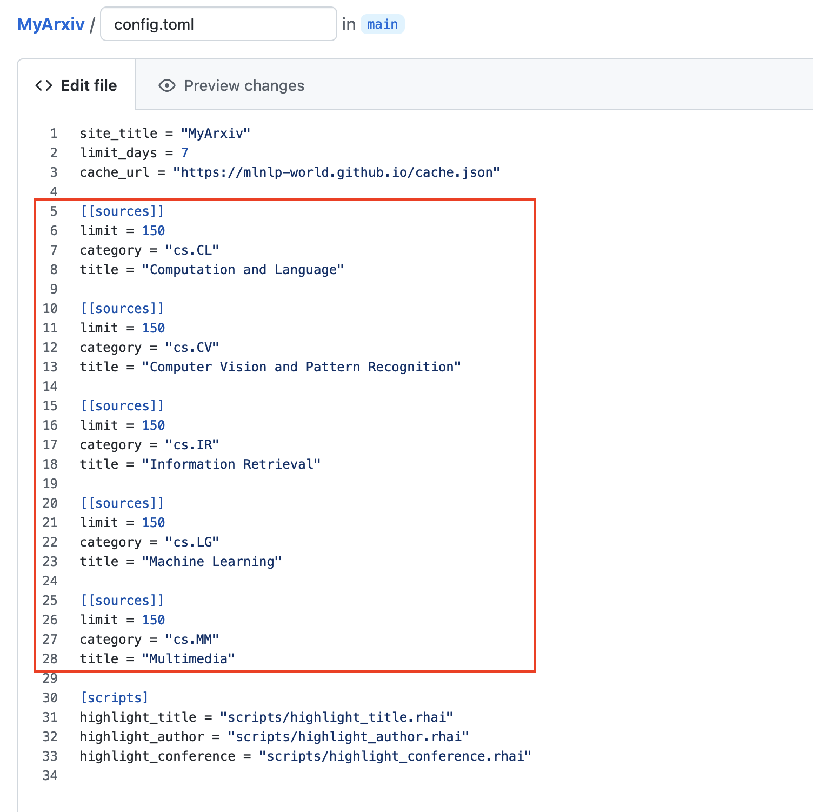

此部分与个人定制的Arxiv领域配置相关，设置的样例如下：

```toml
[[sources]]
limit = 150
category = "cs.CL"
title = "Computation and Language"
```

- `limit`：每天更新当前Arxiv领域中的论文数目，默认为`150`，(*一般来说，大部分单领域Arxiv论文的每日更新数目不会超过150*。)
- `category`：所感兴趣的Arxiv文章领域标识，需根据[Arxiv](https://arxiv.org/)官网查找对应领域的标识。
- `title`：领域标识对应的领域名称，需根据[Arxiv](https://arxiv.org/)官网查找对应领域的名称。

上述设置为一个Arxiv领域对应的设置单元样例，默认设置涵盖NLP研究者主要关注的Arxiv中`cs.CL`、`cs.CV`、`cs.IR`、`cs.LG`以及`cs.MM`领域，使用者可以根据自己的研究偏好参照上述说明进行更改。

<h4 id="highlight-scripts">3. 高亮脚本设置</h4>

`config.toml`配置文件中，高亮脚本设置部分如下图所示：

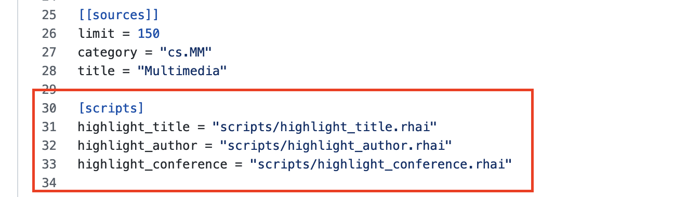

此部分与个人定制的高亮信息相关，使用者在此部分可以根据自己的研究偏好，进一步添加定制化高亮信息。

```toml
[scripts]
highlight_title = "scripts/highlight_title.rhai"
highlight_author = "scripts/highlight_author.rhai"
highlight_conference = "scripts/highlight_conference.rhai"
```

目前所支持的高亮信息，包括文章标题、作者和会议名称三个方面。然而此部分所给出的信息只有脚本文件的位置，使用者需要转移到脚本文件夹`./scripts`下修改对应的高亮配置文件`./scripts/config.rhai`，其中文件中相关设置部分如下：

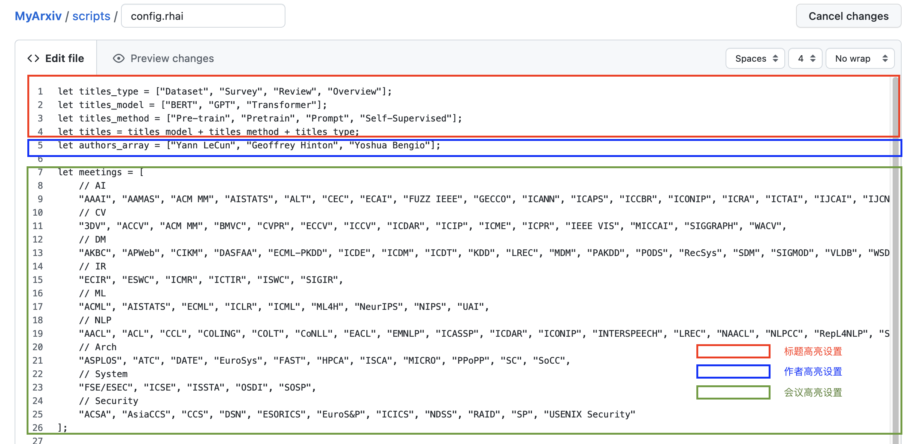

在`./scripts/config.rhai`中，定制化改动如下：

- `let titles = titles_model + titles_method + titles_type;`：标题的高亮可以自定义其内容，默认由***模型***、***方法***以及***类型***三部分组成：
  - `let titles_type = ["Dataset", "Survey"];`：添加需要高亮的文章类型；
  - `let titles_model = ["BERT", "GPT", "Transformer"];`添加需要高亮的文章模型信息；
  - `let titles_method = ["Pre-train", "Pretrain", "Prompt", "Self-Supervised"];`添加需要高亮的文章方法信息；
- `let authors_array = ["Yann LeCun", "Geoffrey Hinton", "Yoshua Bengio"];`添加需要高亮的作者信息；
- `let conferences = [];` 高亮的会议列表，默认包含了当前AI领域的大部分主流会议信息；

<h4 id="workflow-settings">4. workflow设置</h4>

workflow设置位于文件`./.github/workflows/update-feed.yml`中：

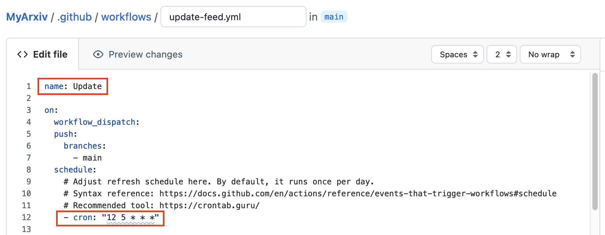

可以参考如下部分需要对此文件进行修改。

- `name: workflowname`：对Workflow进行命名，默认为`Update`。

- `- cron: "12 5 * * *"`：对Workflow运行的时间进行设置，即对MyArxiv每天更新的时间进行设置，*可以参考[crontab](https://crontab.guru/)，对时间进行调整*。

<h4 id="MyArxiv-website-settings">5. MyArxiv网页设置</h4>

完成MyArxiv个性定制化后，下面进行网页显示的修改，主要修改目标文件为`./includes/index.hbs`，使用者可以根据自己的风格喜好对网页格式进行各类更改，如下提供两个更改样例:

- 网页标题的修改：

  在`index.hbs`中，网页标题相关配置如下所示：

  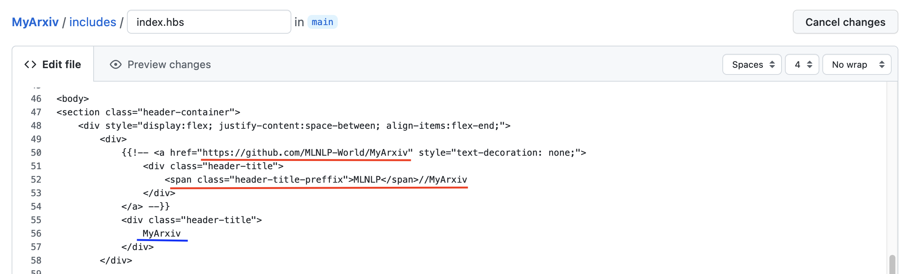

  - 其中位于`line 56`的蓝线高亮部分为当前配置的网页标题，使用者可以自行进行更改：

    ```js
    <div class="header-title">
                    NAME YOU LIKE
                </div>
    ```

  - 其中位于`index.hbs `中`line 50 `的分区中已经注释掉的部分中，红线高亮部分表示将自己的`MyArxiv`仓库地址进行链接并对标题进行重新命名的相关设置，可以使用此设置，替代默认的网页标题，修改格式如下：

    ```js
        <div style="display:flex; justify-content:space-between; align-items:flex-end;">
            <div>
                <a href="https://github.com/username/reponame" style="text-decoration: none;">
                    <div class="header-title">
                        <span class="header-title-preffix">NAME YOU LIKE
                    </div>
                </a>
            </div>
    ```

- 徽章的修改：

  在`index.hbs`中，网页标题相关配置如下所示：

  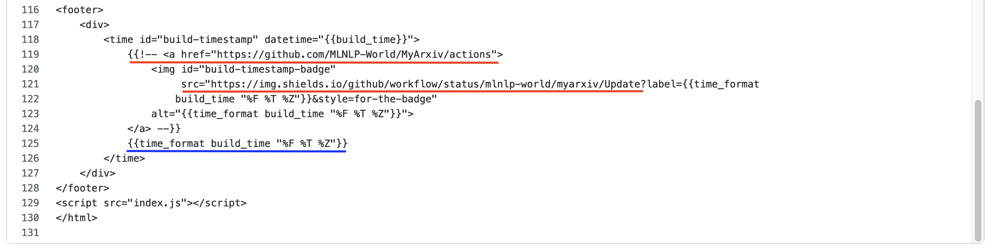
  
  - 其中位于`line 125`的蓝线高亮部分为当前配置的网页时间戳，使用者可以根据自己需要进行自行更改：
  
    ```js
    {{time_format build_time "%F %T %Z"}}
    ```
  
  - 其中位于`index.hbs `中`line 119 `的分区中已经注释掉的部分中，红线高亮部分表示使用shield.io实时更新当前workflow的build时间戳，对`index.hbs`中`line 118`链接的workflow地址进行修改；可以使用此设置，设置徽章替代默认的网页时间戳，修改格式如下：
  
    ```js
    
    ```

    其中涉及`workflowname`需要与`./.github/workflows/update-feed.yml`中的`name`的保持一致。

配置修改完成，将上述更改提交至个人的Github仓库。

<h4 id="Github-Pages-settings">6. Github Pages设置</h4>

在完成上述定制后，需要对个人的MyArxiv库Github Pages进行设置，将项目进行托管：

- 访问`Github Pages`设置`https://github.com/username/reponame/settings/pages`

  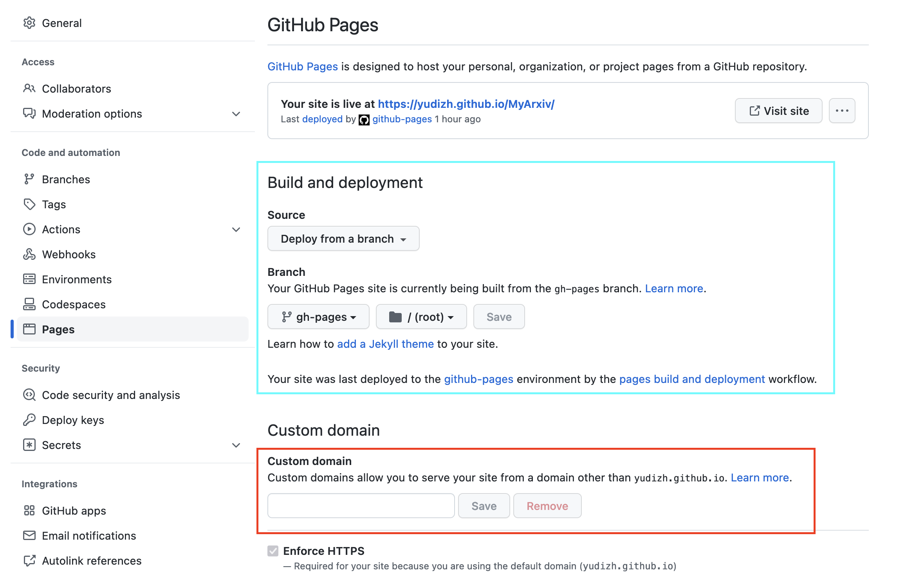

- 若使用`username.github.io`来托管MyArxiv，则：
  - 将其中的`Branch`设置为`gh-pages`分支；
  - 成功Build后，定制化结束；
  - 访问`username.github.io./reponame`，即可实现MyArxiv的定制化访问
  
- 若使用其他域名来托管MyArxiv，则：
  - 将其中的`Branch`设置为`gh-pages`分支；
  - 将自己的域名填入`Custom Domain`;
  - 在`./statics`文件夹下新建`CNAME`文件，将域名写入其中:
  
    ```shell
    >> cd ./statics
    >> touch CNAME
    >> echo "your domain" > CNAME
    ```
  - 成功Build后，定制化结束；
  - 访问`username.github.io/reponame`，即可实现MyArxiv的定制化访问

到这里，就实现了`MyArxiv`的定制化。**Enjoy *YourArxiv*  !**

## 参考资源
该项目部分参考如下项目：
- [ArxivFeed Template](https://github.com/NotCraft/ArxivDaily)
- Powered By [ArxivFeed](https://github.com/NotCraft/ArxivFeed)

## 致谢
感谢如下项目对本项目提供的帮助：
- [Osmosfeed](https://github.com/osmoscraft/osmosfeed)
- [AlongWY Version](https://github.com/AlongWY/ArxivDaily)
- [LooperXX Osmosfeed Version](https://github.com/LooperXX/ArxivDaily-Old)

## 组织者
感谢以下同学对本项目的组织

<a href="https://github.com/AlongWY">  </a>
<a href="https://github.com/LooperXX">  </a>
<a href="https://github.com/YudiZh">  </a>
<a href="https://github.com/yizhen20133868">  </a>


## 贡献者
感谢以下同学对本项目的支持与贡献

<a href="https://github.com/AlongWY">  </a>
<a href="https://github.com/LooperXX">  </a>
<a href="https://github.com/YudiZh">  </a>

